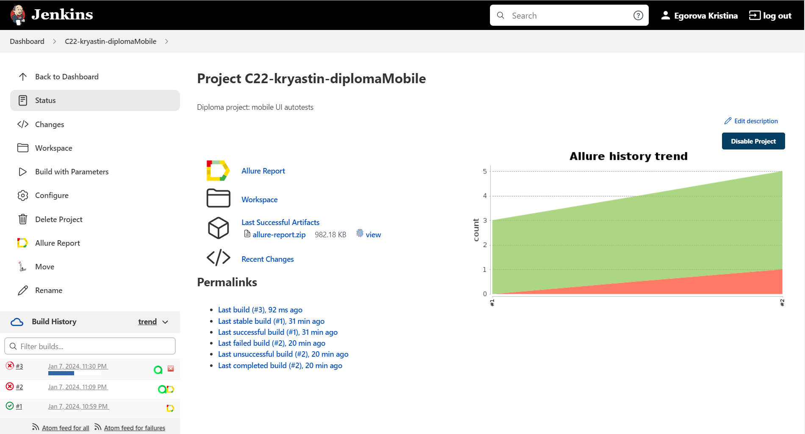
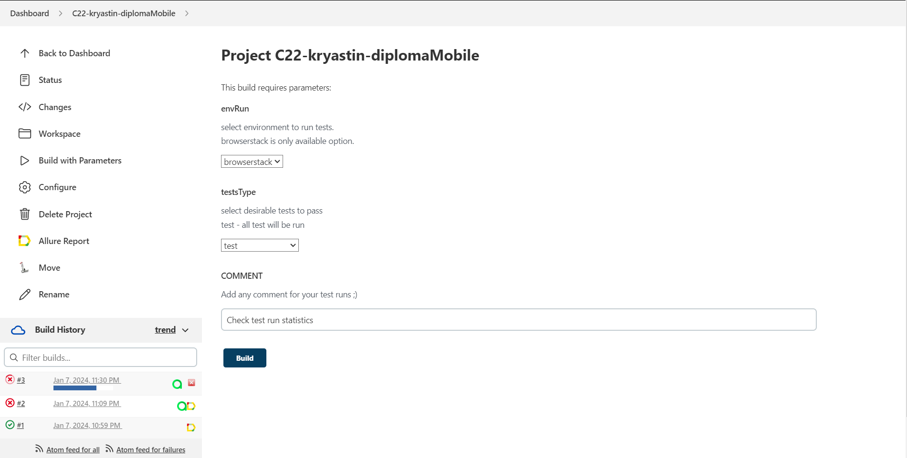
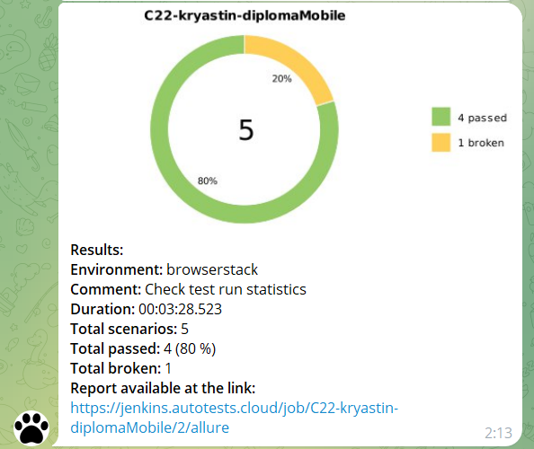
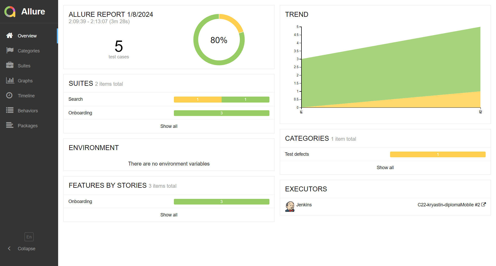
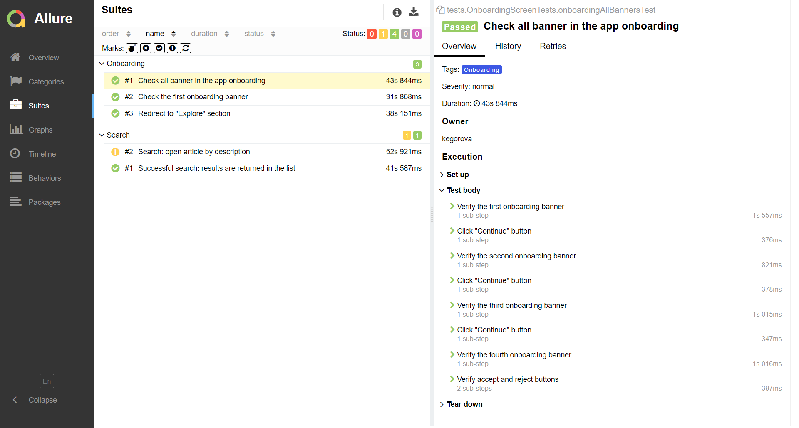
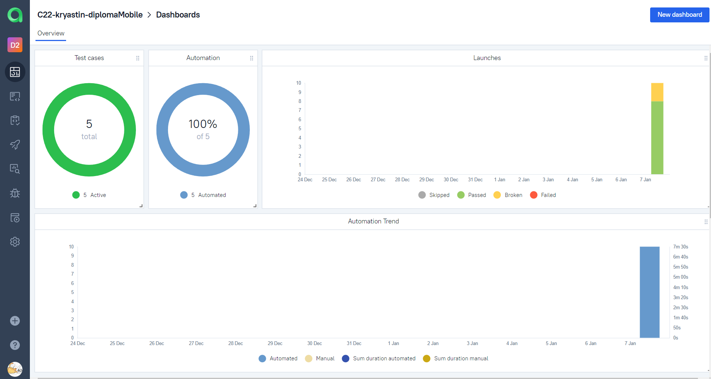
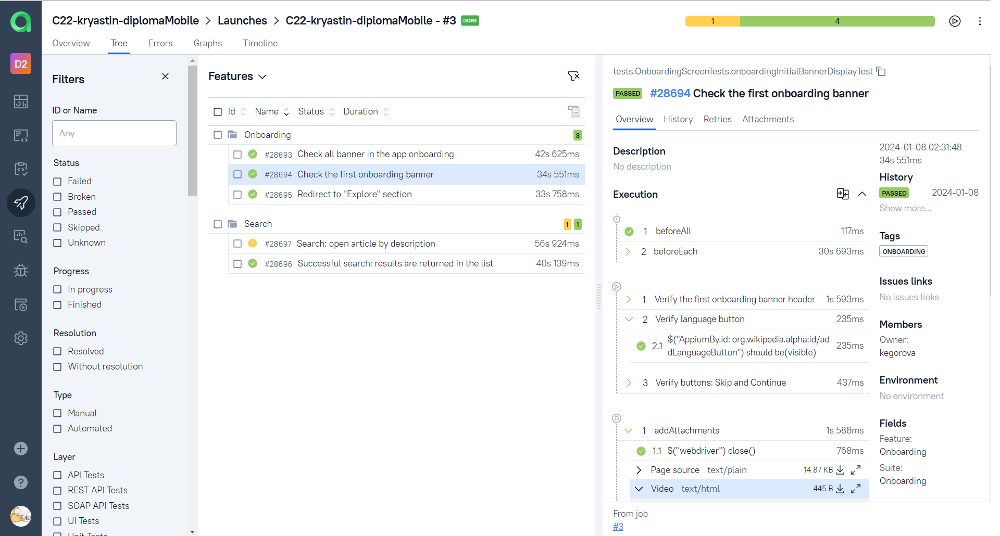
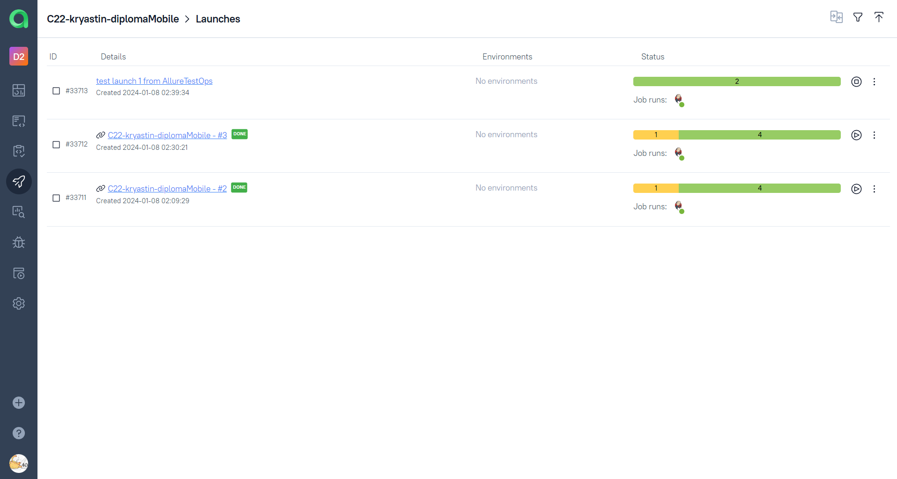

# Mobile test automation project for [Wikipedia App](https://github.com/wikimedia/apps-android-wikipedia/)
<center></center>

## Summary
+ [About the project](#about)
+ [Tools and Technologies](#tools)
+ [How to run](#launch)
    + [Launch tests on emulator](#local)
    + [Launch tests on browserstack](#remote)
+ [Run in Jenkins](#jenkins)
+ [Telegram Notifications](#telegram)
+ [Report in Allure Report](#allure-report)
+ [Allure TestOps Integration](#allureTO)
+ [Video example of test pass](#video)

<a id="about"></a>
## About the project
The project consists of UI Mobile tests. A brief list of interesting facts:
- [x] `Page object` pattern for app screens
- [x] Config with `Owner` library
- [x] Different configuration files for test running depending on build parameters
- [x] Autotests as test documentation
- [x] Run tests by `Tags` or all at once

<a id="tools"></a>
## Tools and Technologies
<a href="https://www.java.com/en/"></a>
<a href="https://gradle.org/"></a>
<a href="https://github.com/"></a>
<a href="https://appium.io/"></a>
<a href="https://developer.android.com/"></a>
<a href="https://www.browserstack.com/"></a>
<a href="https://www.jetbrains.com/idea/"></a>
<a href="https://junit.org/junit5/"></a>
<a href="https://www.jenkins.io/"></a>
<a href="https://github.com/allure-framework/"></a>
<a href="https://qameta.io/"></a>
<a href="https://telegram.org/"></a>

The project is written in `Java` using `Selenide` framework.
- `Gradle` - is used as a build automation tool.
- `JUnit5` - to execute tests.
- `Appium, Android Studio` - for running tests locally on machine
- `Browserstack` - for running tests remotely.
- `Jenkins` - is CI/CD for running tests remotely.
- `Telegram Bot` - for test results notifications.
- `Allure Report` - for test results visualisation.
- `Allure TestOps` - as Test Management System.

<a id="launch"></a>
## How to run
<a id="local"></a>
### Launch tests on emulator
> [!IMPORTANT]
> Be sure you have installed: Java, Gradle and Node.js. It is also important to set up Appium server, Appium UIAutomator2, Android Studio.

Tests are divided by different features, it is possible to run not only all tests but also by feature tags.  
Available feature test runs are:
- onboarding_tests
- search_tests

Use the following command to run all tests:
```
gradle clean test -Denv_test_run=emulator
```
<a id="remote"></a>
### Launch tests on browserstack
> [!IMPORTANT]
> Browserstack requires unique user credentials. Also, before running tests, download the latest version of app and upload to the browserstack. Get unique app id and set in the configuration file. 

Use following command to run all tests in the browser stack
```
gradle clean test -Denv_test_run=browserstack
```
All configurations are described in the `browserstack.properties` and `emulator.properties` files.  
If needed configurations could be changed in those files.

<a id="jenkins"></a>
## Run in [Jenkins](https://jenkins.autotests.cloud/job/C22-kryastin-diplomaMobile/)



Build with parameters allows to customize your test run. For example, different environments to run.



<a id="telegram"></a>
## Telegram Notifications

Telegram bot sends a brief report to a specified telegram chat by results of each build.



<a id="allure-report"></a>
## Report in Allure Report
Main page with common information



List of tests with steps and test artefacts



<a id="allureTO"></a>
## Allure [TestOps Integration](https://allure.autotests.cloud/project/3926/dashboards)
>Test-cases in the project are imported and constantly updated from the code, so there is no need in complex process of synchronization manual test-cases and autotests.  
>It is enough to create and update an autotest in the code and the test-case in TMS always will be in actual state.  
>Manual test-cases also can be added in TMS in case of need (via web interface or via code).
### Dashboard preview

  

### Test cases

  

### Test runs

  

<a id="video"></a>
## Video example of test pass
<p>
  
</p>
